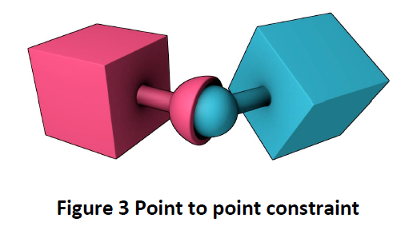

# octet

Octet is a framework for teaching OpenGL and the rudiments of game programming such
as Geometry construction, Shaders, Matrices, Rigid body Physics and Fluid dynamics.

It has a number of examples in the src/examples directory.

To use with visual studio, fork this repository into your own account and then
"Clone Into Desktop" using the GitHub tool and open one of the .sln files in src/examples.

There is a python script for generating your own projects from a template.

From the octet directory run:

packaging\make_example.py my_example

To create your own project in src/examples

Examples should also work with Xcode, although testing is a lot less thorough. If it does not work, send
me a pull request with fixes, please...

Octet is a bit unusual in that it does not use external libraries such as libjpeg or zlib.
These are implemented in source form in the framework so that you can understand the code.
The source of most academic libraries is almost unreadble, so we aim to help your understanding
of coding codecs such as GIF, JPEG, ZIP and so on.

# Legend of Hilda - A Fink of the Past

## Brief
To take the base game from example_invaderers and modify it into a different game.
The project directory is: octet\octet\src\examples\example_invaderers

[Gameplay demonstration](https://youtu.be/Bep4o-j899k "Gameplay demonstration")

## Introduction
The game is a Zelda clone and the aim is to modify the game enough that it closely follows the mechanics of Zelda.

## Changes made to example_invaderers
Minor tweaks were made in the beginning such as adding a pause button, allowing the invaderers and the player to move in the Y-axis, collision detection with the top and bottom borders and the player taking damage when touching the enemy. 

### Pause button
For the pause button, it was initially assigned to the Esc key and the word 'Paused' would appear in the middle of the screen. After adding extra keys that refer to the alpha characters to the enum in app_common.h, I reassigned the pause button to 'p'. A bug I encountered was that 'Paused' would disappear after trying to pause a second time. Because I've made this function based on the 'Game Over' sprite appearing at the end of the game, I failed to realise that the sprite was loaded initially offscreen and then moved into view. For the 'Paused' sprite, this would mean that it is continually moved in one direction every time the pause button is pressed. I fixed this by creating a variable for the position of the 'Paused' sprite and inverted the position every time the button is pressed.

    paused_position_x = -paused_position_x;
    sprites[paused_sprite].translate(paused_position_x, 0);
    
### Y-axis movement
This is a relatively simple change made to the invaderers and the player. For the invaderers, I just added a value in the move_invaderers() function for the Y-axis. For the player, I've added two more if statements for up and down movement.

### Collision detection
Now that the player and the enemy has Y-axis movement, the borders on the top and bottom of the game will have to keep them in. The collision detection code for invaderers live in the simulate() function while the collision detection code for the player is kept where the player makes inputs.

    sprite &border = sprites[first_border_sprite + (invader_velocity < 0 ? 2 : 3)];
    if (invaders_collide(border_x)) {
      invader_velocity = -invader_velocity;
      move_invaders(invader_velocity, 0);
    }
    
The invaderer collision code for the border is tied to the velocity of the invaderer. The border sprite the invaderer will collide with depends on the direction it is going. Then when the invader collides with the border, it will invert its velocity, changing its direction as well as the border the collision detection code will look for. To make it do the same for the top and bottom borders, I changed the original code to this:

    sprite &border_x = sprites[first_border_sprite + (invader_velocity_x < 0 ? 2 : 3)];
    if (invaders_collide(border_x)) {
      invader_velocity_x = -invader_velocity_x;
      move_invaders(invader_velocity_x, 0);
    }
    
    sprite &border_y = sprites[first_border_sprite + (invader_velocity_y < 0 ? 0 : 1)];
    if (invaders_collide(border_y)) {
      invader_velocity_y = -invader_velocity_y;
      move_invaders(0, invader_velocity_y);
    }
    
I've split the variable border to border_x and border_y and split the invader_velocity to invader_velocity_x and invader_velocity_y. The code is similar to one for the X-axis but adapted for the Y-axis and the top and bottom borders.

### Player collision
    if (is_key_down(key_left)) {
      sprites[player_sprite].translate(-player_speed, 0);
      if (sprites[player_sprite].collides_with(sprites[first_border_sprite + 2])) {
        sprites[player_sprite].translate(+player_speed, 0);
      }
    }
    
The player collision works just like the invaderer collision but the difference here would be that each border is set to a key input and when the player collides with the border it negates the movement instead of reversing it. This is because the player will continually push a direction and the collision will continually push the opposite direction causing the player to stay at the same spot.

The final bit of collision detection for the player is when the player collides with the invaderers. I just added an if statement where the other collision detection code for invaderers are:

    sprite &player = sprites[player_sprite];
    if (invaders_collide(player)) {
      on_hit_player();
    }
    
I've added a player_collision_disabled variable to the on_hit_player() function. This is based on the timers made for the missiles and bombs. The idea here is to give the player some invulnerability frames so that the collision wouldn't eat all of the player's lives while trying to move away. The timer is set to 0 when a bomb hits the player though. This is so that the player won't be invulnerable for longer than intended.

## Animating sprites
To animate the sprites, I found a post by TheNut at http://forum.devmaster.net/t/spritesheet-animation-in-opengl/24020 that outlines how I should think about building an animated sprite system in OpenGL. I investigated the code to look for where the UVs will be defined. I found them to be in sprite::render before they were pushed to the shader. Modifying the values led me to discover that the texture coordinates start from the bottom left. While keeping that information in the back of my mind, I started to develop the sprite animation code.

 

To avoid confusion while programming, the sprite class was separated into its own file and #included into invaderers_app.h. While TheNut on the Devmaster forum suggested having an XML file accompanying the sprite sheet, I decided on a simpler system where the sprites are laid out uniformly in a grid. The calculations for the positions and size for each frame of the sprite sheet will be done as the texture is loaded into the game.

 

The sprite is animated by assigning a frame number to each frame of the sprite sheet. As the frame number is iterated through, the coordinates for the corners of the frame are updated and sent through to the shader. The frame size is calculated by determining the number of frames in a row and in a column. The frame width and height as well as the texture width and height are then used to determine the top, bottom, left and right edges of the frame. These will be the coordinates that will be sent to the shader, instead of the whole texture. One thing to take note of is the way the texture coordinates are set up in OpenGL ES. Because the coordinates start from the bottom left, advancing through the sprite sheet would be (x++, y--). 

The range of frames to be used for the animations can also be set as shown with the player's orientation affecting the direction the character is facing. These are a result of the sprite sheet containing animations for these directions. While implementing the sprite animation, I found that even when the player is idle, the animation still continues. I rectified this by setting the minimum frame number and the maximum frame number to be the same. This triggers when the input is released so the player will face and stay idle in the direction he is facing.

# Rope Bridge using Bullet Physics SDK

## Brief
Using example_shapes as the starting point, build a dynamic structure similar to a rope bridge that uses spring constraints.
The project directory is: octet\octet\src\examples\example_shapes

[Physics demonstration](https://youtu.be/LxB24zDqcY0 "Physics demonstration")

## Introduction
The Bullet Physics library is an open source library that handles collision detection, rigid body dynamics and soft body dynamics. It's designed for games, visual effects and robotic simulations. This project will demonstrate constraint and rigid body interactions in a dynamic world. 

## Rigid Bodies
Bullet puts the rigid body dynamics on top of the collision detection module. Adding forces, mass, inertia, velocity and constraints. Bullet uses a type called btRigid body to simulate moving objects. btRigidbody inherits from btCollisionObject which means that it inherit the world transform, friction and restitution. The type adds linear and angular velocity. 

There are three types of objects in Bullet: Dynamic rigidbodies, Static rigidbodies and kinematic rigidbodies. Dynamic rigidbodies are objects that have a positive mass and every step of the simulation fram will update its world transform. Static rigidbodies have zero mass and cannot move. Static rigidbodies are only able to collide with other objects. Kinematic rigidbodies are like static rigidbodies but the difference being that the user can animate it. It can affect dynamic objects but the dynamic objects won't have any effect on it.

## Types of Constraints
Constraints in Bullet are derived from btTypedConstraints. The constraints consists of: btHingeConstraint, btPoint2PointConstraint, btConeTwistConstraint, btSliderConstraint and btGeneric6DofSpringConstraint. Constraints works between two rigid bodies and one of the two rigidbodies will have to be dynamic.

The hinge constraint restricts three angular degrees of freed so that the rigid bodies can only rotate around one axis. It's used for doors or wheels rotating on one axis. 

 

The point to point constraint limits the translation so the pivot points of two rigid bodies will match in world space. You can connect a chain of rigid bodies with this constraint.

 

The cone twist constraint is useful if you want to animate things like the forearms of a character. It's a special point to point constraint that has cone and twist axis limits. The X-axis serves as the twist axis.

The slide constraint allows the rigid bodies to rotate around one axis and translate along this axis.

 

The Generic 6 Degrees of Freedom Constraint can emulate any of the standard constraints. You can customize each of the degrees of freedom and emulate the standard constraints. The first degrees of freedom handle the translation of the rigid mbodies and the last three manages the angular motion.

Information referenced from: Coumans, E., 2015. Bullet 2.83 Physics SDK Manual.[e-book] bulletphysics.org. Available at: Github <https://github.com/bulletphysics/bullet3/blob/master/docs/Bullet_User_Manual.pdf> [Accessed 6 November 2016].

## The Rope Bridge
The bridge was made using box meshes and btGeneric6DofSpringConstraints. It is made of a simple array of rigid bodies bookended by static rigid bodies. The bridge was built first and then the constraints were put in afterwards. I had to put a constraint on each side of the plank in order to stabilise the bridge. If it was only one line of constraints then the planks would rotate. To demonstrate the stability of the bridge, I've assigned: Q, W, E, R, A, S, D to spawn objects to drop onto the bridge. The first four keys will drop particles on different parts of the bridge while the last three keys will spawn bigger shapes.

